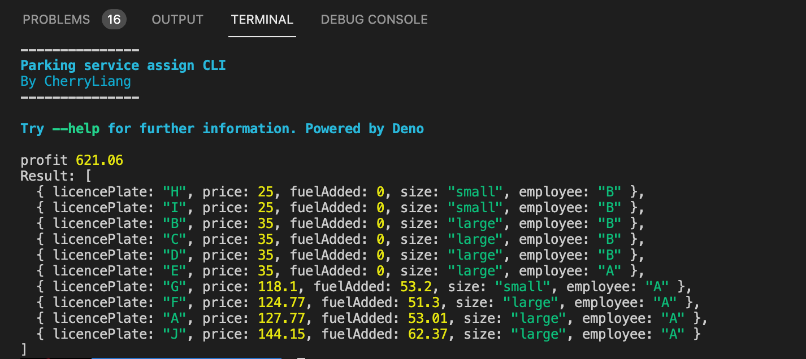

## Parking Service System

### Requirement

- Responsible: assign the workload equally between the two employees in a way that favours profit.

- Parking rate: Small cars - $25，large vehicles - $35
- Fuel rate: Every car with 10% or less fuel, will be refueled to maximum capacity - $1.75/litre
- Commission rate: Employee A - 11%, Employee B - 15%

### Solutions

Two solutions on Parking Service System, one focuses on front end, another one is implemented with Deno, which is a new experiment on this powerful backend framework.

- [Parking Service CLI](https://github.com/CaiYiLiang/maxProfitAssignTask-deno): Deno, Typescript
- [Parking Service dashboard](https://max-profit-assign-task.vercel.app/): React, Typescript

#### New Change

- Replaced `.reducer()` method with higher-order function `Array.map()` in `getAllCarsBillStatement`.
  - `Array.reducer()` is for reduction usage. While it is a very powerful method, it's not always the easiest to read or grasp at a glance. An saying: `the simplest code is written sequentially`.
- Replaced `for loop` with `Array.map()` in `carServiceAssigner`.
- [Parking Service CLI](https://github.com/CaiYiLiang/maxProfitAssignTask-deno) - Enable the ability to log the argument data (cars, employees) and save as local data in JSON format. **Note:** Command updated.

#### Parking Service CLI

- Play around with it
  - [Install Deno](https://deno.land/manual@v1.11.0/getting_started/installation)
  - To have a test run, open terminal and run `deno run mod.ts`
  - To get the maxProfitAssigningTask result with default data, open terminal and run `deno run --allow-read mod.ts --db`
    **NOTE:** `--allow-read` is required as the security mechanism of Deno.
  - To get the maxProfitAssigningTask result with new/customize data, open terminal and run `deno run --allow-write --allow-read mod.ts --data '[{ "licencePlate": "A", "size": "large", "fuel": { "capacity": 57, "level": 0.07 } }, { "licencePlate": "B", "size": "large", "fuel": { "capacity": 66, "level": 0.59 } }, { "licencePlate": "C", "size": "large", "fuel": { "capacity": 54, "level": 0.49 } }, { "licencePlate": "D", "size": "large", "fuel": { "capacity": 79, "level": 0.93 } }, { "licencePlate": "E", "size": "large", "fuel": { "capacity": 94, "level": 0.2 } }, { "licencePlate": "F", "size": "large", "fuel": { "capacity": 57, "level": 0.1 } }, { "licencePlate": "G", "size": "small", "fuel": { "capacity": 56, "level": 0.05 } }, { "licencePlate": "H", "size": "small", "fuel": { "capacity": 61, "level": 0.78 } }, { "licencePlate": "I", "size": "small", "fuel": { "capacity": 60, "level": 0.65 } }, { "licencePlate": "J", "size": "large", "fuel": { "capacity": 63, "level": 0.01 } } ]' --employee '[{"employee": "A", "commission":0.11}, {"employee": "B", "commission":0.15}]' `
    **NOTE:** Data of cars and employees will be log as local data in JSON format. `--allow-write --allow-read` is required as the security mechanism of Deno.

##### Screen

